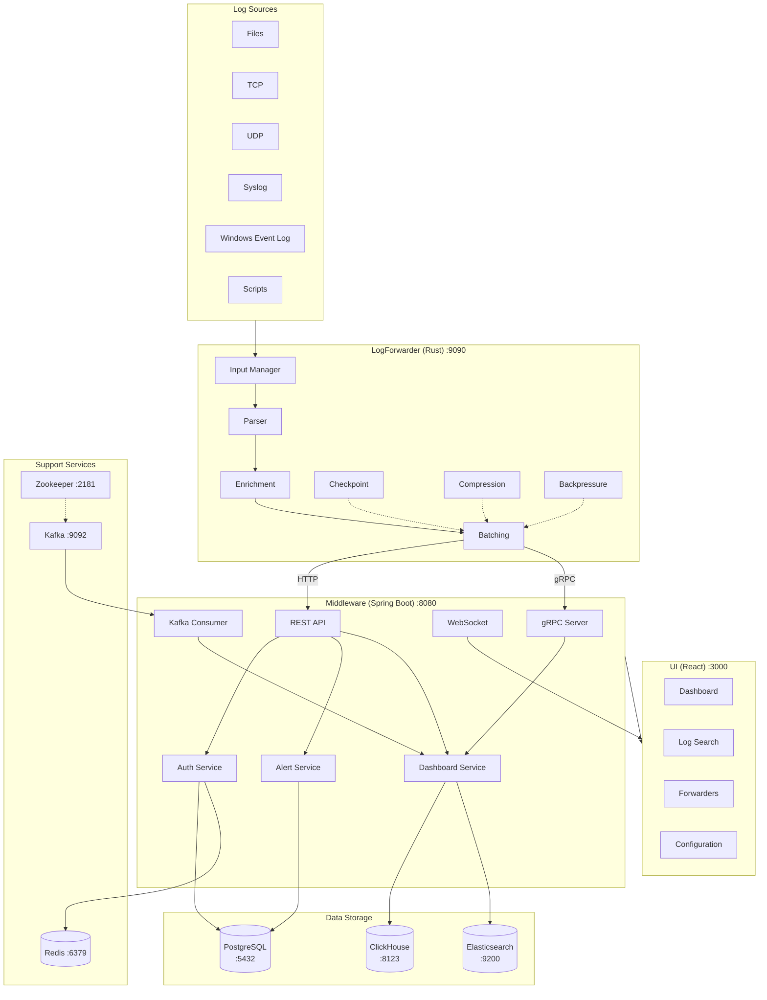
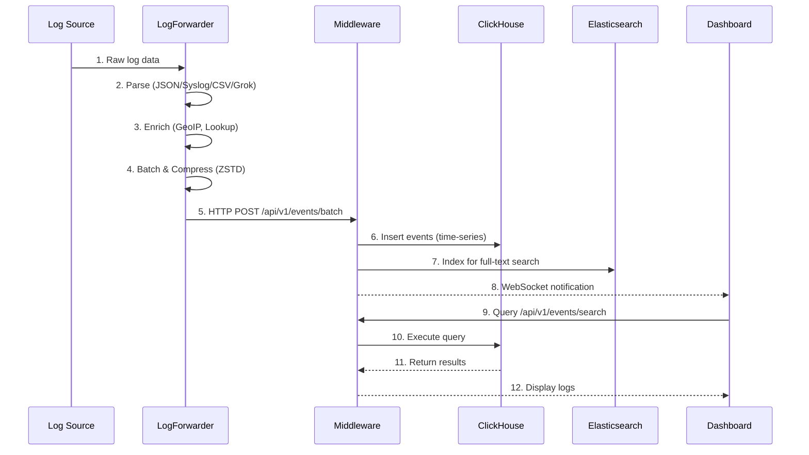

# LogForwarder - Enterprise Log Monitoring System

A high-performance, Splunk-like log monitoring system for collecting, processing, storing, and visualizing log data at scale. Built with Rust, Java Spring Boot, and React.

## Table of Contents

- [Quick Start](#quick-start)
- [System Architecture](#system-architecture)
  - [Architecture Diagram (ASCII)](#architecture-diagram-ascii)
  - [Architecture Diagram (Mermaid)](#architecture-diagram-mermaid)
  - [Data Flow Diagram](#data-flow-diagram)
- [Technology Stack](#technology-stack)
- [Components](#components)
  - [LogForwarder (Rust Agent)](#logforwarder-rust-agent)
  - [Middleware (Spring Boot API)](#middleware-spring-boot-api)
  - [UI (React Dashboard)](#ui-react-dashboard)
- [Infrastructure Services](#infrastructure-services)
  - [ClickHouse](#clickhouse)
  - [Elasticsearch](#elasticsearch)
  - [PostgreSQL](#postgresql)
  - [Redis](#redis)
  - [Redis Commander](#redis-commander)
  - [Kafka](#kafka)
  - [Port Mapping](#port-mapping)
- [Setup Guide](#setup-guide)
  - [Prerequisites](#prerequisites)
  - [Docker Quick Start](#docker-quick-start)
  - [Manual Setup](#manual-setup)
  - [Environment Configuration](#environment-configuration)
- [API Reference](#api-reference)
  - [Authentication](#authentication)
  - [Events API](#events-api)
  - [Forwarders API](#forwarders-api)
  - [Alerts API](#alerts-api)
  - [Users API](#users-api)
  - [Dashboard API](#dashboard-api)
  - [Configuration API](#configuration-api)
- [Database Schema](#database-schema)
  - [ClickHouse Tables](#clickhouse-tables)
  - [PostgreSQL Tables](#postgresql-tables)
- [Configuration Reference](#configuration-reference)
  - [LogForwarder Configuration](#logforwarder-configuration)
  - [Middleware Configuration](#middleware-configuration)
  - [UI Configuration](#ui-configuration)
  - [Docker Configuration](#docker-configuration)
- [Project Structure](#project-structure)

---

## Quick Start

Get the entire system running in 5 minutes using Docker.

### Prerequisites

- Docker Desktop 4.0+ with Docker Compose v2
- 8GB+ RAM available for containers
- Ports available: 3000, 8080, 8085, 8086, 8123, 8124, 9000, 9090, 9092, 9200, 5432, 6379, 2181

### Start All Services

**Windows:**
```batch
cd docker
start.bat dev
```

**Linux/macOS:**
```bash
cd docker
./start.sh dev
```

**Or using Docker Compose directly:**
```bash
cd docker
cp .env.example .env
docker-compose up -d
```

### Verify Services

After startup, verify the services are running:

| Service | URL | Description |
|---------|-----|-------------|
| UI Dashboard | http://localhost:3000 | Web interface |
| Middleware API | http://localhost:8080 | REST API |
| ClickHouse | http://localhost:8123/play | Database UI |
| Tabix | http://localhost:8124 | ClickHouse Web UI |
| Kafka UI | http://localhost:8085 | Kafka Web UI |
| Redis Commander | http://localhost:8086 | Redis Web UI |
| Elasticsearch | http://localhost:9200 | Search API |
| LogForwarder Metrics | http://localhost:9090/metrics | Prometheus metrics |

### Default Credentials

- **UI Login**: admin / admin
- **ClickHouse**: logforwarder / logforwarder
- **PostgreSQL**: logforwarder / logforwarder

### Stop Services

```bash
cd docker
./start.sh stop   # Linux/macOS
start.bat stop    # Windows
```

---

## System Architecture

### Architecture Diagram (ASCII)

```
┌─────────────────────────────────────────────────────────────────────────────────────┐
│                              LOG SOURCES                                            │
│  ┌─────────┐  ┌─────────┐  ┌─────────┐  ┌─────────┐  ┌─────────┐  ┌─────────┐      │
│  │  Files  │  │   TCP   │  │   UDP   │  │ Syslog  │  │ WinEvent│  │ Scripts │      │
│  └────┬────┘  └────┬────┘  └────┬────┘  └────┬────┘  └────┬────┘  └────┬────┘      │
└───────┼────────────┼────────────┼────────────┼────────────┼────────────┼────────────┘
        │            │            │            │            │            │
        └────────────┴────────────┴─────┬──────┴────────────┴────────────┘
                                        │
                                        ▼
┌─────────────────────────────────────────────────────────────────────────────────────┐
│                         LOGFORWARDER (Rust Agent) :9090                             │
│  ┌─────────────┐  ┌─────────────┐  ┌─────────────┐  ┌─────────────┐                 │
│  │   Inputs    │─▶│   Parser    │─▶│  Enrichment │─▶│   Batching  │                 │
│  │   Manager   │  │  (Multi-fmt)│  │  (GeoIP,etc)│  │  (Adaptive) │                 │
│  └─────────────┘  └─────────────┘  └─────────────┘  └──────┬──────┘                 │
│  ┌─────────────┐  ┌─────────────┐  ┌─────────────┐         │                        │
│  │ Checkpoint  │  │ Compression │  │ Backpressure│◀────────┘                        │
│  │   Store     │  │   (ZSTD)    │  │   Monitor   │                                  │
│  └─────────────┘  └─────────────┘  └──────┬──────┘                                  │
└───────────────────────────────────────────┼─────────────────────────────────────────┘
                                            │
                          ┌─────────────────┼─────────────────┐
                          │ HTTP :8080      │ gRPC :50051     │
                          ▼                 ▼                 │
┌─────────────────────────────────────────────────────────────────────────────────────┐
│                       MIDDLEWARE (Spring Boot) :8080                                │
│  ┌─────────────┐  ┌─────────────┐  ┌─────────────┐  ┌─────────────┐                 │
│  │    REST     │  │   gRPC      │  │  WebSocket  │  │   Kafka     │                 │
│  │ Controllers │  │   Server    │  │   (STOMP)   │  │  Consumer   │                 │
│  └──────┬──────┘  └──────┬──────┘  └──────┬──────┘  └──────┬──────┘                 │
│         └─────────────────┴───────────────┴────────────────┘                        │
│                                   │                                                  │
│  ┌─────────────┐  ┌─────────────┐ │ ┌─────────────┐  ┌─────────────┐                │
│  │   Auth      │  │   Alert     │ │ │  Dashboard  │  │   Config    │                │
│  │  Service    │  │  Service    │◀┘ │  Service    │  │  Service    │                │
│  └─────────────┘  └─────────────┘   └─────────────┘  └─────────────┘                │
└───────────────────────────────────────────┬─────────────────────────────────────────┘
                                            │
        ┌───────────────────────────────────┼───────────────────────────────────────┐
        │                                   │                                   │
        ▼                                   ▼                                   ▼
┌───────────────┐                   ┌───────────────┐                   ┌───────────────┐
│  ClickHouse   │                   │ Elasticsearch │                   │  PostgreSQL   │
│    :8123      │                   │     :9200     │                   │    :5432      │
│  (Time-series)│                   │ (Full-text)   │                   │(Transactional)│
└───────────────┘                   └───────────────┘                   └───────────────┘
        │                                   │                                   │
        └───────────────────────────────────┼───────────────────────────────────┘
                                            │
┌─────────────────────────────────────────────────────────────────────────────────────┐
│  ┌─────────────┐                  ┌─────────────┐                                   │
│  │    Redis    │                  │    Kafka    │                                   │
│  │    :6379    │                  │    :9092    │                                   │
│  │  (Caching)  │                  │  (Streaming)│                                   │
│  └─────────────┘                  └─────────────┘                                   │
└─────────────────────────────────────────────────────────────────────────────────────┘
                                            │
                                            ▼
┌─────────────────────────────────────────────────────────────────────────────────────┐
│                            UI (React/TypeScript) :3000                              │
│  ┌─────────────┐  ┌─────────────┐  ┌─────────────┐  ┌─────────────┐                 │
│  │  Dashboard  │  │  LogSearch  │  │  Forwarders │  │   Alerts    │                 │
│  └─────────────┘  └─────────────┘  └─────────────┘  └─────────────┘                 │
│  ┌─────────────┐  ┌─────────────┐  ┌─────────────┐                                  │
│  │    Users    │  │  Settings   │  │   Config    │                                  │
│  └─────────────┘  └─────────────┘  └─────────────┘                                  │
└─────────────────────────────────────────────────────────────────────────────────────┘
```

### Architecture Diagram (Mermaid)



### Data Flow Diagram

**ASCII Version:**
```
┌──────────────┐     ┌──────────────┐     ┌──────────────┐     ┌──────────────┐
│  Log Source  │────▶│ LogForwarder │────▶│  Middleware  │────▶│   Storage    │
│   (Files,    │     │   (Rust)     │     │ (Spring Boot)│     │ (ClickHouse, │
│  TCP, UDP)   │     │              │     │              │     │  ES, PG)     │
└──────────────┘     └──────────────┘     └──────────────┘     └──────────────┘
       │                    │                    │                    │
       │                    │                    │                    │
       ▼                    ▼                    ▼                    ▼
┌──────────────┐     ┌──────────────┐     ┌──────────────┐     ┌──────────────┐
│ 1. Collect   │     │ 2. Parse &   │     │ 3. Validate  │     │ 4. Store &   │
│    logs from │     │    enrich    │     │    & route   │     │    index     │
│    sources   │     │    events    │     │    events    │     │    data      │
└──────────────┘     └──────────────┘     └──────────────┘     └──────────────┘
                                                 │
                                                 ▼
                                          ┌──────────────┐
                                          │   5. Query   │
                                          │   & display  │◀──── UI Dashboard
                                          │   in UI      │
                                          └──────────────┘
```

**Mermaid Version:**


---

## Technology Stack

| Layer | Technology | Version | Purpose |
|-------|------------|---------|---------|
| **Agent** | Rust | 2021 Edition | High-performance log collection |
| **API** | Java | 21 | Backend runtime |
| **API** | Spring Boot | 3.4.0 | REST API framework |
| **UI** | React | 19.2.0 | Frontend framework |
| **UI** | TypeScript | 5.9.3 | Type-safe JavaScript |
| **UI** | Vite | 7.2.4 | Build tool |
| **Database** | ClickHouse | 24.1 | Time-series storage |
| **Database** | PostgreSQL | 15 | Transactional storage |
| **Search** | Elasticsearch | 8.11 | Full-text search |
| **Cache** | Redis | 7 | Caching & sessions |
| **Queue** | Kafka | Latest | Event streaming |
| **Compression** | ZSTD | 0.13 | Log compression |
| **Protocol** | gRPC | 0.11 | High-performance RPC |

---

## Components

### LogForwarder (Rust Agent)

High-performance log collection agent written in Rust for maximum throughput and minimal resource usage.

**Location:** `/LogForwarder/`

#### Modules

| Module | Description |
|--------|-------------|
| `backpressure` | Monitors system load and throttles input when overwhelmed |
| `batching` | Adaptive batching with configurable size and memory limits |
| `checkpoint` | Persists file reading positions for resume after restart |
| `cli` | Command-line argument parsing |
| `compression` | ZSTD compression with dictionary support |
| `config` | Configuration loading and validation |
| `config_diff` | Detects configuration changes at runtime |
| `config_health_checker` | Validates configuration health |
| `config_history` | Tracks configuration changes with audit trail |
| `crc` | CRC32 checksums for data integrity |
| `disk_monitor` | Monitors disk space and pauses inputs when low |
| `enrichment` | GeoIP, lookup tables, and field enrichment |
| `env_loader` | Environment variable loading |
| `error` | Error types and handling |
| `event` | Core event data structures |
| `file_registry` | Tracks monitored files and metadata |
| `file_watcher` | Filesystem event monitoring (notify) |
| `graceful_shutdown` | Clean shutdown with checkpoint save |
| `input_batch_manager` | Manages batches across multiple inputs |
| `inputs` | Input plugins (file, TCP, UDP, syslog, Windows Event Log, HTTP poller, scripted) |
| `logging` | Structured logging with tracing |
| `masking` | PII detection and data masking |
| `metrics` | Prometheus metrics exporter |
| `monitor` | File system monitoring |
| `network` | HTTP/gRPC client for output |
| `outputs` | Output destinations (HTTP, gRPC) |
| `parser` | Multi-format parsing (JSON, CSV, Syslog, Grok, Regex, Raw) |
| `pattern` | Glob pattern matching for file discovery |
| `pipeline` | Event processing pipeline |
| `queue` | Thread-safe event queue |
| `routing` | Conditional routing based on event fields |
| `rotation` | Log rotation detection |

#### Input Types

| Input Type | Description |
|------------|-------------|
| **File** | Tail files with glob patterns, rotation detection, checkpointing |
| **TCP** | Accept logs over TCP connections |
| **UDP** | Accept logs over UDP datagrams |
| **Syslog** | RFC 3164/5424 syslog protocol |
| **Windows Event Log** | Native Windows event log collection |
| **Scripted** | Execute scripts and capture output |
| **HTTP Poller** | Poll HTTP endpoints for data |

#### Output Protocols

| Protocol | Description |
|----------|-------------|
| **HTTP** | REST API batch endpoint (`POST /api/v1/events/batch`) |
| **gRPC** | High-performance streaming to middleware |

#### Key Features

- **Format Detection**: Automatic detection of JSON, CSV, Syslog, and custom formats
- **ZSTD Compression**: Up to 10x compression with optional dictionary
- **Checkpointing**: Resume from last position after restart
- **Backpressure**: Automatic throttling when downstream is slow
- **Prometheus Metrics**: Expose metrics on port 9090

---

### Middleware (Spring Boot API)

Java-based REST API and event processing backend.

**Location:** `/middleware/`  
**Java Version:** 21  
**Spring Boot Version:** 3.4.0

#### Package Structure

| Package | Count | Description |
|---------|-------|-------------|
| `controller` | 7 | REST API endpoints |
| `service` | 10 | Business logic |
| `entity` | 11 | Database entities |
| `repository` | 12 | Data access layer |
| `kafka` | 3 | Kafka consumers/producers |
| `websocket` | 8 | Real-time WebSocket handlers |
| `grpc` | 2 | gRPC server implementation |

#### Controllers

| Controller | Base Path | Description |
|------------|-----------|-------------|
| `AuthController` | `/api/v1/auth` | JWT authentication, login, logout, refresh |
| `EventController` | `/api/v1/events` | Event ingestion and search |
| `ForwarderController` | `/api/v1/forwarders` | Forwarder registration and monitoring |
| `AlertController` | `/api/v1/alerts` | Alert management |
| `UserController` | `/api/v1/users` | User management (CRUD) |
| `DashboardController` | `/api/v1/dashboard` | Dashboard statistics |
| `ConfigurationController` | `/api/v1/config` | System configuration |

#### Services

| Service | Description |
|---------|-------------|
| `AuthService` | JWT token generation, validation, user authentication |
| `EventService` | Event storage, search, and retrieval |
| `ForwarderService` | Forwarder lifecycle management |
| `AlertService` | Alert creation, acknowledgment, resolution |
| `AlertRuleEvaluator` | Evaluates alert rules against events |
| `SearchService` | Elasticsearch full-text search |
| `MetricsService` | System and forwarder metrics |
| `NotificationService` | Email, Slack, webhook notifications |
| `AuditService` | Audit log recording |
| `EventProcessingMetrics` | Event processing statistics |

#### Database Integrations

| Database | Purpose |
|----------|---------|
| **ClickHouse** | Time-series event storage, analytics |
| **PostgreSQL** | User accounts, transactional data |
| **Elasticsearch** | Full-text search indexing |
| **Redis** | Session caching, rate limiting |

#### Real-time Features

- **WebSocket (STOMP)**: Real-time event streaming to UI
- **Kafka Consumer**: Async event processing from queue
- **gRPC Server**: High-throughput event ingestion on port 50051

---

### UI (React Dashboard)

Modern web dashboard for log visualization and system management.

**Location:** `/ui/`  
**React Version:** 19.2.0  
**Build Tool:** Vite 7.2.4

#### Pages

| Page | Route | Description |
|------|-------|-------------|
| `Dashboard` | `/` | System overview, charts, recent events |
| `LogSearch` | `/logs` | Search and filter log events |
| `Forwarders` | `/forwarders` | Forwarder status and management |
| `Configuration` | `/configuration` | System configuration editor |
| `Users` | `/users` | User account management |
| `Settings` | `/settings` | Application settings |
| `Login` | `/login` | Authentication page |

#### State Management

| Context | Purpose |
|---------|---------|
| `AuthContext` | User authentication state, JWT tokens |
| `WebSocketContext` | Real-time connection management |

#### Hooks

| Hook | Purpose |
|------|---------|
| `useApi` | REST API calls with error handling |
| `useWebSocket` | WebSocket subscription management |

#### Styling

- **styled-components**: CSS-in-JS styling
- **Theme System**: Dark/light mode support
- **lucide-react**: Icon library
- **recharts**: Data visualization charts

---

## Infrastructure Services

### ClickHouse

Primary time-series database for high-volume log storage and analytics.

- **Image**: `clickhouse/clickhouse-server:24.1`
- **Ports**: 8123 (HTTP), 9000 (Native), 9004 (MySQL)
- **Web UI**: http://localhost:8123/play
- **Use Cases**: Event storage, time-range queries, aggregations

### Elasticsearch

Full-text search engine for log content searching.

- **Image**: `elasticsearch:8.11`
- **Port**: 9200
- **Use Cases**: Keyword search, full-text queries, log analysis

### PostgreSQL

Relational database for transactional data.

- **Image**: `postgres:15`
- **Port**: 5432
- **Use Cases**: User accounts, audit logs, configuration

### Redis

In-memory cache and session store.

- **Image**: `redis:7`
- **Port**: 6379
- **Use Cases**: Session storage, rate limiting, caching

### Redis Commander

Web-based interface for monitoring and managing Redis. Auto-connects to the local Redis container.

- **Image**: `rediscommander/redis-commander:latest`
- **Port**: 8086
- **Access**: http://localhost:8086
- **Features**: Key browser, CLI, real-time monitoring
- **Auto-configured**: Connects to `redis:6379` automatically

### Kafka

Distributed message queue for event streaming.

- **Image**: `confluentinc/cp-kafka`
- **Port**: 9092
- **Use Cases**: Async event processing, decoupling components

### Kafka UI

Web-based interface for monitoring and managing Apache Kafka clusters.

- **Image**: `provectuslabs/kafka-ui:latest`
- **Port**: 8085
- **Web UI**: http://localhost:8085
- **Use Cases**: Topic management, consumer group monitoring, message browsing, cluster health

### Port Mapping

| Service | Port | Protocol | Description |
|---------|------|----------|-------------|
| UI | 3000 | HTTP | Web dashboard |
| Middleware API | 8080 | HTTP | REST API |
| gRPC Server | 50051 | gRPC | Event streaming |
| LogForwarder Metrics | 9090 | HTTP | Prometheus metrics |
| ClickHouse HTTP | 8123 | HTTP | REST API / Web UI |
| ClickHouse Native | 9000 | TCP | Native protocol |
| ClickHouse MySQL | 9004 | TCP | MySQL wire protocol |
| Elasticsearch | 9200 | HTTP | REST API |
| PostgreSQL | 5432 | TCP | Database |
| Redis | 6379 | TCP | Cache |
| Kafka | 9092 | TCP | Message broker |
| Zookeeper | 2181 | TCP | Kafka coordination |
| Tabix | 8124 | HTTP | ClickHouse Web UI |
| Kafka UI | 8085 | HTTP | Kafka Web UI |
| Redis Commander | 8086 | HTTP | Redis Web UI |

---

## Setup Guide

This section provides complete step-by-step instructions to get the system running locally.

---

### Step 1: Install Required Software

#### 1.1 Docker Desktop (Required for Docker Setup)

| OS | Download | Installation |
|----|----------|--------------|
| Windows | [Docker Desktop for Windows](https://desktop.docker.com/win/main/amd64/Docker%20Desktop%20Installer.exe) | Run installer, enable WSL 2 backend |
| macOS | [Docker Desktop for Mac](https://desktop.docker.com/mac/main/amd64/Docker.dmg) | Drag to Applications |
| Linux | [Docker Engine](https://docs.docker.com/engine/install/) | Follow distro-specific instructions |

**Verify Installation:**
```bash
docker --version
# Expected: Docker version 24.0.0 or higher

docker-compose --version
# Expected: Docker Compose version v2.20.0 or higher

docker info
# Should show Docker Engine running
```

#### 1.2 Git (Required)

| OS | Download | Installation |
|----|----------|--------------|
| Windows | [Git for Windows](https://git-scm.com/download/win) | Run installer with defaults |
| macOS | `xcode-select --install` | Or [download](https://git-scm.com/download/mac) |
| Linux | `sudo apt install git` | Or `sudo yum install git` |

**Verify Installation:**
```bash
git --version
# Expected: git version 2.40.0 or higher
```

#### 1.3 Java 21 (Required for Manual Middleware Setup)

| OS | Download | Installation |
|----|----------|--------------|
| Windows | [Eclipse Temurin JDK 21](https://adoptium.net/temurin/releases/?version=21) | Run .msi installer |
| macOS | `brew install openjdk@21` | Or [download](https://adoptium.net/temurin/releases/?version=21) |
| Linux | `sudo apt install openjdk-21-jdk` | Or use SDKMAN |

**Verify Installation:**
```bash
java --version
# Expected: openjdk 21.0.x or higher

javac --version
# Expected: javac 21.0.x or higher

echo %JAVA_HOME%    # Windows
echo $JAVA_HOME     # Linux/macOS
# Should point to JDK 21 installation
```

#### 1.4 Maven 3.9+ (Required for Manual Middleware Setup)

| OS | Download | Installation |
|----|----------|--------------|
| Windows | [Apache Maven](https://maven.apache.org/download.cgi) | Extract to `C:\Program Files\Maven`, add to PATH |
| macOS | `brew install maven` | Or [download](https://maven.apache.org/download.cgi) |
| Linux | `sudo apt install maven` | Or [download](https://maven.apache.org/download.cgi) |

**Verify Installation:**
```bash
mvn --version
# Expected: Apache Maven 3.9.x or higher
# Should show Java version 21
```

#### 1.5 Rust 1.75+ (Required for Manual LogForwarder Setup)

| OS | Download | Installation |
|----|----------|--------------|
| Windows | [rustup-init.exe](https://win.rustup.rs/x86_64) | Run installer, follow prompts |
| macOS/Linux | `curl --proto '=https' --tlsv1.2 -sSf https://sh.rustup.rs \| sh` | Follow prompts |

**Verify Installation:**
```bash
rustc --version
# Expected: rustc 1.75.0 or higher

cargo --version
# Expected: cargo 1.75.0 or higher
```

#### 1.6 Node.js 22+ (Required for Manual UI Setup)

| OS | Download | Installation |
|----|----------|--------------|
| Windows | [Node.js LTS](https://nodejs.org/en/download/) | Run .msi installer |
| macOS | `brew install node@22` | Or [download](https://nodejs.org/en/download/) |
| Linux | [NodeSource](https://github.com/nodesource/distributions) | `curl -fsSL https://deb.nodesource.com/setup_22.x \| sudo -E bash -` |

**Verify Installation:**
```bash
node --version
# Expected: v22.0.0 or higher

npm --version
# Expected: 10.0.0 or higher
```

---

### Step 2: Clone the Repository

```bash
git clone https://github.com/YOUR_ORG/monitoring-tool.git
cd monitoring-tool
```

**Verify Clone:**
```bash
ls -la
# Should see: docker/, LogForwarder/, middleware/, ui/, README.md
```

---

### Step 3: Choose Setup Method

Choose **Option A (Docker)** for quick start or **Option B (Manual)** for development.

---

### Option A: Docker Setup (Recommended for Quick Start)

#### A.1 Navigate to Docker Directory

```bash
cd docker
```

#### A.2 Create Environment Configuration

```bash
# Copy example environment file
cp .env.example .env
```

**Review/Edit `.env` file (optional for development):**
```bash
# Windows
notepad .env

# Linux/macOS
nano .env
# or
vim .env
```

#### A.3 Start All Services

**Windows:**
```batch
start.bat dev
```

**Linux/macOS:**
```bash
chmod +x start.sh
./start.sh dev
```

**Or using Docker Compose directly:**
```bash
docker-compose up -d
```

#### A.4 Wait for Services to Start

Services start in dependency order. Wait approximately 2-3 minutes for all services to be healthy.

**Check Service Status:**
```bash
docker-compose ps
```

**Expected Output:**
```
NAME                        STATUS
logforwarder-clickhouse     Up (healthy)
logforwarder-elasticsearch  Up (healthy)
logforwarder-postgres       Up (healthy)
logforwarder-redis          Up (healthy)
logforwarder-zookeeper      Up (healthy)
logforwarder-kafka          Up (healthy)
logforwarder-kafka-ui       Up (healthy)
logforwarder-tabix          Up
logforwarder-middleware     Up (healthy)
logforwarder-forwarder      Up
logforwarder-ui             Up
```

#### A.5 Verify Services Are Running

Run these health check commands:

```bash
# ClickHouse
curl http://localhost:8123/ping
# Expected: Ok.

# Elasticsearch
curl http://localhost:9200/_cluster/health
# Expected: JSON with "status": "green" or "yellow"

# Middleware API
curl http://localhost:8080/actuator/health
# Expected: {"status":"UP"}

# UI (open in browser)
curl http://localhost:3000
# Expected: HTML content
```

#### A.6 Access the Application

| Service | URL | Credentials |
|---------|-----|-------------|
| **UI Dashboard** | http://localhost:3000 | admin / admin |
| **Middleware API** | http://localhost:8080/swagger-ui.html | - |
| **ClickHouse UI** | http://localhost:8123/play | logforwarder / logforwarder |
| **Tabix (ClickHouse)** | http://localhost:8124 | logforwarder / logforwarder |
| **Kafka UI** | http://localhost:8085 | - |
| **Redis Commander** | http://localhost:8086 | - |
| **Elasticsearch** | http://localhost:9200 | elastic / elastic_password |

#### A.7 View Logs

```bash
# All services
docker-compose logs -f

# Specific service
docker-compose logs -f middleware
docker-compose logs -f logforwarder
docker-compose logs -f ui
```

#### A.8 Stop Services

```bash
# Stop all services (preserves data)
docker-compose stop

# Or using script
./start.sh stop    # Linux/macOS
start.bat stop     # Windows

# Stop and remove containers (preserves volumes)
docker-compose down

# Stop and remove everything including data
docker-compose down -v
```

---

### Option B: Manual Setup (For Development)

#### Service Startup Order

Start services in this order due to dependencies:

```
1. Infrastructure: ClickHouse → Elasticsearch → PostgreSQL → Redis → Zookeeper → Kafka
2. Application: Middleware → LogForwarder → UI
```

#### B.1 Start Infrastructure Services (Docker)

Even for manual development, run infrastructure in Docker:

```bash
cd docker
cp .env.example .env

# Start only infrastructure services
docker-compose up -d clickhouse elasticsearch postgres redis zookeeper kafka tabix kafka-ui
```

**Wait for infrastructure to be healthy:**
```bash
docker-compose ps
# All infrastructure services should show "Up (healthy)"
```

#### B.2 Setup and Start Middleware (Java/Spring Boot)

**Terminal 1:**
```bash
cd middleware

# Step 1: Verify Java version
java --version
# Must be Java 21

# Step 2: Create environment file (if not exists)
cp src/main/resources/application-dev.yml src/main/resources/application-local.yml

# Step 3: Build the application
mvn clean package -DskipTests
# Expected: BUILD SUCCESS

# Step 4: Verify JAR was created
ls target/*.jar
# Expected: logforwarder-middleware-1.0.0.jar

# Step 5: Run the application
java -jar target/logforwarder-middleware-1.0.0.jar --spring.profiles.active=dev
# Expected: "Started MiddlewareApplication in X seconds"
```

**Verify Middleware is Running:**
```bash
curl http://localhost:8080/actuator/health
# Expected: {"status":"UP"}
```

#### B.3 Setup and Start LogForwarder (Rust)

**Terminal 2:**
```bash
cd LogForwarder

# Step 1: Verify Rust version
rustc --version
# Must be 1.75+

# Step 2: Create environment file
cp .env.example .env

# Step 3: Edit .env to point to local middleware
# Windows
notepad .env
# Linux/macOS
nano .env

# Ensure these values:
# MIDDLEWARE_URL=http://localhost:8080
# FORWARDER_ID=local-forwarder
# METRICS_PORT=9090

# Step 4: Build the application
cargo build --release
# Expected: Compiling... Finished release [optimized] target

# Step 5: Verify binary was created
ls target/release/high-perf-forwarder*
# Expected: high-perf-forwarder (or high-perf-forwarder.exe on Windows)

# Step 6: Run the application
./target/release/high-perf-forwarder --config config/inputs.yaml
# Windows: .\target\release\high-perf-forwarder.exe --config config/inputs.yaml
# Expected: "LogForwarder started"
```

**Verify LogForwarder is Running:**
```bash
curl http://localhost:9090/metrics
# Expected: Prometheus metrics output
```

#### B.4 Setup and Start UI (React)

**Terminal 3:**
```bash
cd ui

# Step 1: Verify Node.js version
node --version
# Must be v22+

# Step 2: Create environment file
cp .env.example .env 2>/dev/null || echo "VITE_API_URL=http://localhost:8080" > .env

# Step 3: Edit .env
echo "VITE_API_URL=http://localhost:8080" > .env
echo "VITE_WS_URL=ws://localhost:8080/ws" >> .env

# Step 4: Install dependencies
npm install
# Expected: added XXX packages

# Step 5: Start development server
npm run dev
# Expected: "VITE vX.X.X ready in XXX ms"
# Expected: "Local: http://localhost:3000/"
```

**Verify UI is Running:**
Open http://localhost:3000 in your browser. You should see the login page.

---

### Step 4: Verify Complete System

After starting all services, verify the complete system:

#### 4.1 Health Check Commands

```bash
# Check all Docker containers
docker ps --format "table {{.Names}}\t{{.Status}}\t{{.Ports}}"

# Check ClickHouse
curl -s http://localhost:8123/ping && echo " ClickHouse OK"

# Check Elasticsearch
curl -s http://localhost:9200/_cluster/health | grep -o '"status":"[^"]*"'

# Check PostgreSQL
docker exec logforwarder-postgres pg_isready -U logforwarder

# Check Redis
docker exec logforwarder-redis redis-cli ping

# Check Kafka
docker exec logforwarder-kafka kafka-broker-api-versions.sh --bootstrap-server localhost:9092 | head -1

# Check Middleware
curl -s http://localhost:8080/actuator/health | grep -o '"status":"[^"]*"'

# Check LogForwarder metrics
curl -s http://localhost:9090/metrics | head -5

# Check UI
curl -s -o /dev/null -w "%{http_code}" http://localhost:3000
# Expected: 200
```

#### 4.2 Login Test

1. Open http://localhost:3000
2. Login with: **admin** / **admin**
3. You should see the Dashboard

#### 4.3 Send Test Log Event

```bash
curl -X POST http://localhost:8080/api/v1/events/batch \
  -H "Content-Type: application/json" \
  -d '{
    "forwarderId": "test-forwarder",
    "events": [{
      "timestamp": "'$(date -u +%Y-%m-%dT%H:%M:%SZ)'",
      "source": "test",
      "host": "localhost",
      "message": "Test log message",
      "level": "INFO"
    }]
  }'
# Expected: {"success":true,"data":{"received":1}}
```

---

### Step 5: Troubleshooting

#### Port Already in Use

```bash
# Find process using a port (e.g., 8080)
# Windows
netstat -ano | findstr :8080

# Linux/macOS
lsof -i :8080

# Kill process by PID
# Windows
taskkill /PID <PID> /F

# Linux/macOS
kill -9 <PID>
```

#### Docker Container Won't Start

```bash
# Check container logs
docker logs logforwarder-middleware

# Restart specific container
docker-compose restart middleware

# Rebuild and restart
docker-compose up -d --build middleware
```

#### ClickHouse Connection Refused

```bash
# Check if ClickHouse is running
docker logs logforwarder-clickhouse

# Verify ClickHouse is accepting connections
docker exec logforwarder-clickhouse clickhouse-client --query "SELECT 1"
```

#### Elasticsearch Out of Memory

Add to `.env`:
```bash
ES_JAVA_OPTS=-Xms512m -Xmx512m
```

#### Middleware Can't Connect to Database

1. Ensure infrastructure containers are healthy
2. Check connection settings in `application.yml`
3. Verify network connectivity:
```bash
docker network inspect logforwarder-network
```

#### UI Shows "Network Error"

1. Verify Middleware is running on port 8080
2. Check CORS settings in Middleware
3. Verify `.env` has correct `VITE_API_URL`

---

### Environment Configuration Reference

#### Docker Environment (`docker/.env`)

```bash
# ClickHouse
CLICKHOUSE_DB=logforwarder
CLICKHOUSE_USER=logforwarder
CLICKHOUSE_PASSWORD=logforwarder

# PostgreSQL
POSTGRESQL_DB=logforwarder
POSTGRESQL_USER=logforwarder
POSTGRESQL_PASSWORD=logforwarder_password

# Elasticsearch
ELASTIC_PASSWORD=elastic_password

# Redis
REDIS_PASSWORD=redis_password

# JWT Authentication
JWT_SECRET=your-secret-key-min-32-chars
JWT_EXPIRATION_MS=86400000

# Application
SPRING_PROFILES_ACTIVE=dev
VITE_API_URL=http://localhost:8080
```

#### LogForwarder Environment (`LogForwarder/.env`)

```bash
MIDDLEWARE_URL=http://localhost:8080
FORWARDER_ID=local-forwarder
METRICS_PORT=9090
LOG_LEVEL=info
```

#### UI Environment (`ui/.env`)

```bash
VITE_API_URL=http://localhost:8080
VITE_WS_URL=ws://localhost:8080/ws
```

---

## API Reference

### Authentication

All API endpoints (except `/api/v1/auth/login` and `/api/v1/events/batch`) require JWT authentication.

**Login:**
```http
POST /api/v1/auth/login
Content-Type: application/json

{
  "username": "admin",
  "password": "admin"
}
```

**Response:**
```json
{
  "success": true,
  "data": {
    "accessToken": "eyJhbGc...",
    "refreshToken": "eyJhbGc...",
    "expiresIn": 86400000
  }
}
```

**Using the Token:**
```http
GET /api/v1/events/search
Authorization: Bearer eyJhbGc...
```

### Events API

| Method | Endpoint | Description |
|--------|----------|-------------|
| `POST` | `/api/v1/events/batch` | Ingest event batch (public) |
| `GET` | `/api/v1/events/search` | Search events with filters |
| `GET` | `/api/v1/events/search/fulltext` | Full-text search |
| `GET` | `/api/v1/events/recent` | Get recent events |
| `GET` | `/api/v1/events/{id}` | Get event by ID |

**Batch Ingestion:**
```http
POST /api/v1/events/batch
Content-Type: application/json

{
  "forwarderId": "forwarder-001",
  "events": [
    {
      "rawMessage": "2024-01-15 10:30:00 ERROR Database connection failed",
      "severity": "ERROR",
      "sourcetype": "application",
      "timestamp": "2024-01-15T10:30:00Z"
    }
  ]
}
```

**Search Events:**
```http
GET /api/v1/events/search?startTime=2024-01-01T00:00:00Z&endTime=2024-01-31T23:59:59Z&severity=ERROR&page=0&pageSize=50
```

### Forwarders API

| Method | Endpoint | Description |
|--------|----------|-------------|
| `GET` | `/api/v1/forwarders` | List all forwarders |
| `POST` | `/api/v1/forwarders` | Register new forwarder |
| `GET` | `/api/v1/forwarders/{id}` | Get forwarder details |
| `POST` | `/api/v1/forwarders/{id}/heartbeat` | Send heartbeat |
| `GET` | `/api/v1/forwarders/{id}/metrics` | Get forwarder metrics |

### Alerts API

| Method | Endpoint | Description |
|--------|----------|-------------|
| `GET` | `/api/v1/alerts` | List all alerts |
| `POST` | `/api/v1/alerts` | Create alert rule |
| `GET` | `/api/v1/alerts/{id}` | Get alert details |
| `POST` | `/api/v1/alerts/{id}/acknowledge` | Acknowledge alert |
| `POST` | `/api/v1/alerts/{id}/resolve` | Resolve alert |

### Users API

| Method | Endpoint | Description |
|--------|----------|-------------|
| `GET` | `/api/v1/users` | List all users |
| `POST` | `/api/v1/users` | Create user |
| `GET` | `/api/v1/users/{id}` | Get user details |
| `PUT` | `/api/v1/users/{id}` | Update user |
| `DELETE` | `/api/v1/users/{id}` | Delete user |

### Dashboard API

| Method | Endpoint | Description |
|--------|----------|-------------|
| `GET` | `/api/v1/dashboard/summary` | System summary statistics |
| `GET` | `/api/v1/dashboard/logs/recent` | Recent log entries |
| `GET` | `/api/v1/dashboard/health` | System health status |

### Configuration API

| Method | Endpoint | Description |
|--------|----------|-------------|
| `GET` | `/api/v1/config` | Get system configuration |
| `PUT` | `/api/v1/config` | Update configuration |

---

## Database Schema

### ClickHouse Tables

#### events
Primary log event storage with time-series optimization.

```sql
CREATE TABLE events (
    id UInt64,
    event_id String,
    forwarder_id String,
    timestamp DateTime64(3),
    raw_message String,
    raw_data Nullable(String),
    severity String,
    sourcetype String,
    source_name Nullable(String),
    index_name String,
    host Nullable(String),
    parsed_fields Nullable(String),
    enrichments Nullable(String),
    created_at DateTime64(3)
) ENGINE = MergeTree()
PARTITION BY toYYYYMMDD(timestamp)
ORDER BY (timestamp, forwarder_id, id);
```

#### forwarders
Forwarder registration and status.

```sql
CREATE TABLE forwarders (
    id UInt64,
    forwarder_id String,
    name String,
    hostname Nullable(String),
    status String,
    last_heartbeat DateTime64(3),
    events_processed UInt64,
    cpu_usage_percent Float64,
    memory_usage_percent Float64
) ENGINE = ReplacingMergeTree(_version)
ORDER BY (id);
```

#### alerts
Triggered alert instances.

```sql
CREATE TABLE alerts (
    id UInt64,
    rule_id UInt64,
    status String,
    severity String,
    title String,
    triggered_at DateTime64(3),
    resolved_at Nullable(DateTime64(3))
) ENGINE = ReplacingMergeTree(_version)
ORDER BY (id);
```

#### audit_logs
System audit trail.

```sql
CREATE TABLE audit_logs (
    id UInt64,
    user_id Nullable(UInt64),
    action String,
    resource_type String,
    resource_id Nullable(String),
    details Nullable(String),
    ip_address Nullable(String),
    timestamp DateTime64(3)
) ENGINE = MergeTree()
PARTITION BY toYYYYMMDD(timestamp)
ORDER BY (timestamp, id);
```

### PostgreSQL Tables

Used for transactional data requiring ACID compliance.

#### users
User account management.

| Column | Type | Description |
|--------|------|-------------|
| id | BIGSERIAL | Primary key |
| username | VARCHAR(50) | Unique login name |
| email | VARCHAR(100) | Email address |
| password | VARCHAR(255) | bcrypt hash |
| role | VARCHAR(20) | ADMIN, OPERATOR, VIEWER |
| is_active | BOOLEAN | Account enabled |
| created_at | TIMESTAMP | Creation time |

---

## Configuration Reference

### LogForwarder Configuration

**File:** `LogForwarder/config/inputs.yaml`

```yaml
system:
  metrics:
    bind_address: "0.0.0.0"
    port: 9090
    enabled: true

  queue:
    capacity: 65536
    max_memory_mb: 50

  batch:
    size: 1000
    max_memory_mb: 10
    flush_interval_ms: 1000

  checkpoint_path: "var/checkpoint"

format_detection:
  enabled: true
  confidence_threshold: 0.8

inputs:
  - type: file
    name: app_logs
    path: "/var/log/app/*.log"
    sourcetype: application
    follow_tail: true
    checkpoint_interval_ms: 5000

outputs:
  - name: http_output
    url: "http://localhost:8080/api/v1/events/batch"
    forwarder_id: "forwarder-001"
    batch_size: 100
    flush_interval_ms: 5000
    compression_enabled: true
    protocol: "http"
```

### Middleware Configuration

**File:** `middleware/src/main/resources/application.yml`

Key settings:
- `server.port`: API port (default: 8080)
- `spring.datasource.*`: PostgreSQL connection
- `spring.data.redis.*`: Redis connection
- `clickhouse.*`: ClickHouse connection
- `jwt.secret`: JWT signing key
- `jwt.expiration`: Token expiration time

### UI Configuration

**File:** `ui/.env`

```bash
VITE_API_URL=http://localhost:8080
VITE_WS_URL=ws://localhost:8080/ws
```

### Docker Configuration

**File:** `docker/.env`

See [Environment Configuration](#environment-configuration) for all available variables.

---

## Project Structure

```
monitoring-tool/
├── LogForwarder/                 # Rust log collection agent
│   ├── src/
│   │   ├── lib.rs               # Module exports
│   │   ├── main.rs              # Entry point
│   │   ├── inputs/              # Input plugins
│   │   ├── outputs/             # Output destinations
│   │   ├── parser/              # Log parsers
│   │   └── ...                  # Other modules
│   ├── config/
│   │   ├── inputs.yaml          # Default configuration
│   │   ├── inputs_http.yaml     # HTTP output config
│   │   └── inputs_grpc.yaml     # gRPC output config
│   └── Cargo.toml               # Rust dependencies
│
├── middleware/                   # Spring Boot API
│   ├── src/main/java/com/monitoring/logforwarder/
│   │   ├── controller/          # REST controllers (7)
│   │   ├── service/             # Business logic (10)
│   │   ├── entity/              # Database entities (11)
│   │   ├── repository/          # Data access (12)
│   │   ├── kafka/               # Kafka integration (3)
│   │   ├── websocket/           # WebSocket handlers (8)
│   │   └── grpc/                # gRPC server (2)
│   ├── src/main/resources/
│   │   └── application.yml      # Spring configuration
│   └── pom.xml                  # Maven dependencies
│
├── ui/                          # React dashboard
│   ├── src/
│   │   ├── pages/               # Page components (7)
│   │   ├── components/          # Reusable components
│   │   ├── context/             # React contexts (2)
│   │   ├── hooks/               # Custom hooks (3)
│   │   └── styles/              # Global styles
│   ├── package.json             # NPM dependencies
│   └── vite.config.ts           # Vite configuration
│
├── docker/                      # Docker deployment
│   ├── docker-compose.yml       # Development compose
│   ├── docker-compose.prod.yml  # Production compose
│   ├── .env.example             # Environment template
│   ├── start.sh                 # Unix start script
│   ├── start.bat                # Windows start script
│   └── configs/                 # Service configurations
│       ├── clickhouse/
│       │   └── init.sql         # Database schema
│       └── ...
│
└── README.md                    # This documentation
```

---
